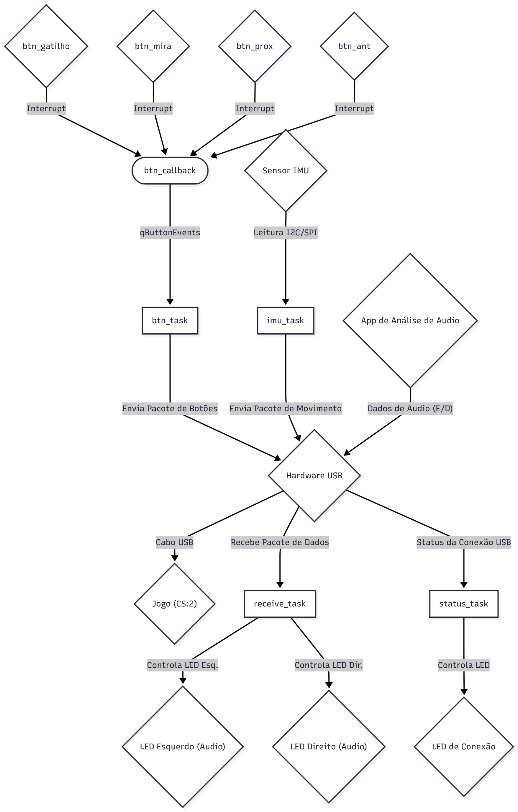

# Controle Glock para Counter-Strike 2 - APS-2

Este repositório contém o projeto de um controle customizado para o jogo Counter-Strike 2, desenvolvido como parte da disciplina de Controle e Automação (APS-2). O controle tem o formato de uma pistola Glock e foi projetado para substituir o mouse, permitindo que o jogador utilize a mão direita para mira e ações, enquanto a mão esquerda permanece no teclado para movimentação.

## 🎮 O Jogo

O controle foi projetado especificamente para **Counter-Strike 2**, um jogo de tiro tático em primeira pessoa que exige precisão e tempo de resposta baixos.

- **Link do Jogo:** [Counter-Strike 2 na Steam](https://store.steampowered.com/app/730/CounterStrike_2/)

## 💡 Ideia do Controle

A principal motivação é criar uma experiência de jogo mais imersiva e intuitiva. Em vez de mover um mouse sobre uma mesa, o jogador aponta o controle-pistola para controlar a mira.

O sistema de mira é baseado em **velocidade**, não em posição absoluta. Isso significa que um movimento rápido do controle para a direita move a mira rapidamente, mas o jogador não precisa virar fisicamente de costas para a tela para fazer um 180° no jogo. Isso permite movimentos rápidos e amplos sem perder a ergonomia.

Além da mira, o controle integra as ações primárias da mão direita (atirar, mirar, trocar de arma) em botões estrategicamente posicionados na própria "arma".

## ⚙️ Inputs e Outputs (Hardware)

O controle utiliza os seguintes componentes:

### Entradas (Sensores)

- **IMU (HW-290):** Um sensor de movimento (acelerômetro + giroscópio) que captura a rotação do controle nos eixos X e Y para controlar a velocidade da mira.
- **Botão 1 (Gatilho):** `btn_gatilho` - Push-button posicionado no gatilho para a ação de atirar (clique esquerdo do mouse).
- **Botão 2 (Mira):** `btn_mira` - Push-button posicionado abaixo do gatilho para a ação de mirar (clique direito do mouse).
- **Botão 3 (Arma Próxima):** `btn_prox` - Push-button na parte traseira do controle, para ser usado com o polegar.
- **Botão 4 (Arma Anterior):** `btn_ant` - Push-button na parte traseira, também para o polegar.

### Saídas (Atuadores)

- **LED de Status:** Um LED que indica o status da conexão USB com o computador (aceso = conectado e pronto).
- **LED Esquerdo (Áudio):** Acende quando um som relevante no jogo (passos, tiros) é detectado vindo da esquerda do jogador.
- **LED Direito (Áudio):** Acende quando um som relevante no jogo é detectado vindo da direita.

## 📡 Protocolo Utilizado

A comunicação com o computador é feita via **USB com fio**, utilizando o protocolo **USB HID (Human Interface Device)**. Isso garante compatibilidade nativa com o sistema operacional (o controle é reconhecido como um mouse/joystick padrão) e oferece a menor latência possível.

Para o feedback de áudio, um aplicativo customizado no PC analisa a saída de som estéreo e envia comandos de volta para o controle pela mesma conexão USB, usando pacotes de dados específicos.

## 📊 Diagrama de Blocos do Firmware

A arquitetura do firmware é baseada em um **RTOS (Real-Time Operating System)** para gerenciar as múltiplas tarefas de forma concorrente e organizada, sem o uso de variáveis globais para comunicação entre os módulos.

O diagrama de blocos a seguir detalha a arquitetura do firmware e **foi validado pelo Prof. Corsi**.

### Explicação dos Componentes do Diagrama

- **Tasks (Tarefas):**
  - `imu_task`: Tarefa dedicada a ler os dados do sensor IMU em alta frequência e enviá-los diretamente ao PC via USB.
  - `btn_task`: Tarefa que aguarda eventos de botões (colocados em uma fila pela ISR) e envia o estado dos botões ao PC.
  - `receive_task`: Responsável por ouvir dados vindos do PC (comandos de áudio) e controlar os LEDs esquerdo e direito.
  - `status_task`: Tarefa de baixa prioridade que monitora o status da conexão USB e controla o LED de status.

- **ISRs (Interrupt Service Routines):**
  - `btn_callback`: Uma única rotina de interrupção que é ativada por qualquer um dos quatro botões. Sua função é unicamente registrar qual botão foi pressionado/solto e enviar essa informação para a `qButtonEvents`, mantendo a interrupção o mais rápida possível.

- **Queues (Filas):**
  - `qButtonEvents`: Fila utilizada para desacoplar a ISR dos botões da `btn_task`. A ISR apenas deposita a informação na fila, e a `btn_task` a consome quando estiver pronta.

- **Semáforos / Mutexes (Consideração de Implementação):**
  - Como tanto a `imu_task` quanto a `btn_task` precisam acessar o hardware USB para enviar dados, um **mutex** será implementado para proteger o endpoint USB, garantindo que apenas uma tarefa escreva no barramento por vez e evitando corrupção de dados.

## 📸 Imagens do Controle

### Proposta de Design (CAD)

[IMAGEM DO MODELO 3D EM BREVE]

### Protótipo Final

[FOTO DO CONTROLE FISICO EM BREVE]

## ✅ Qualidade de Código

O código-fonte deste projeto segue as boas práticas de desenvolvimento para sistemas embarcados e foi validado com as ferramentas `cppcheck` e `embedded-check` para garantir a ausência de erros comuns e a conformidade com os padrões de qualidade.
